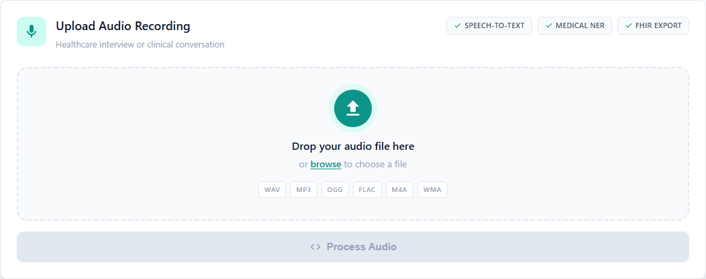
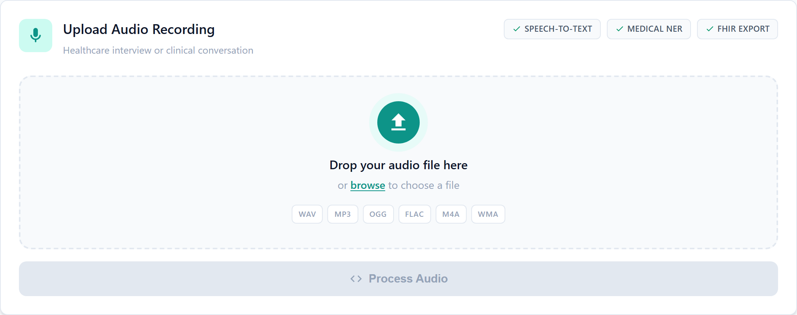
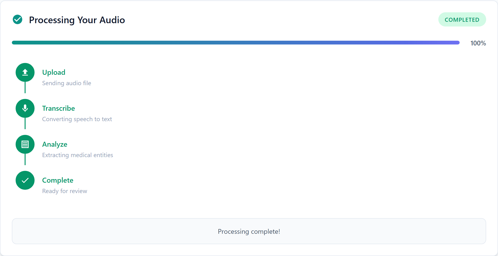
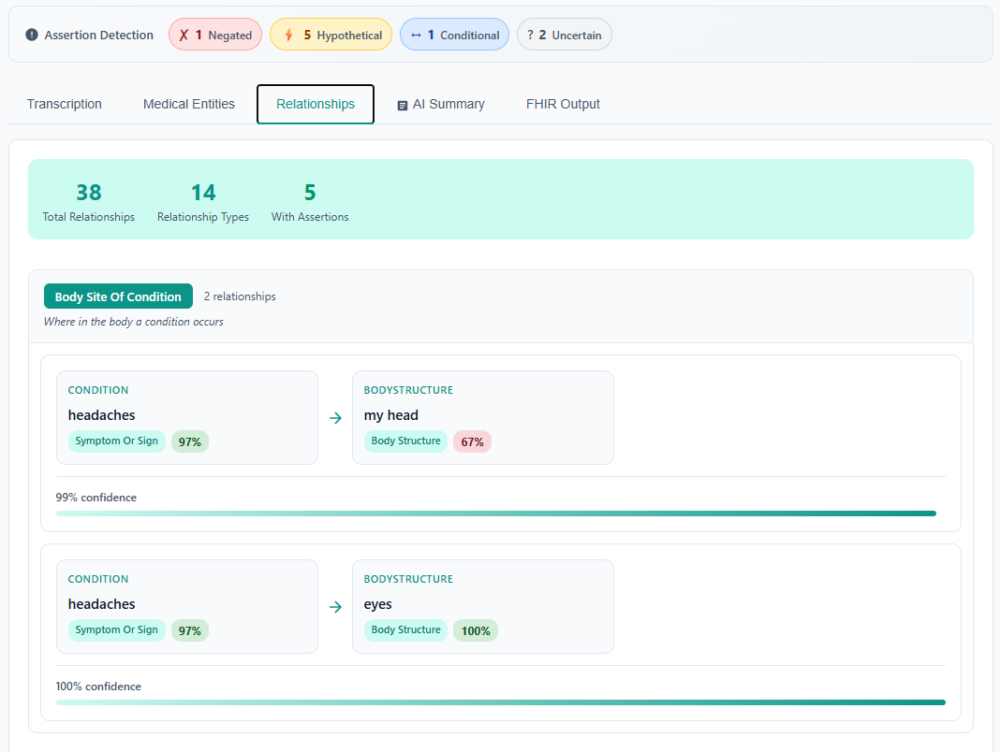
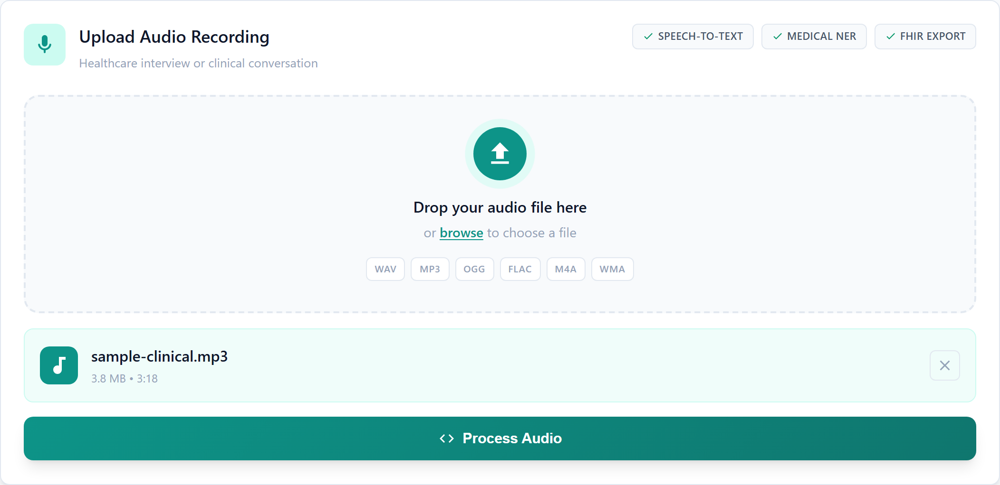
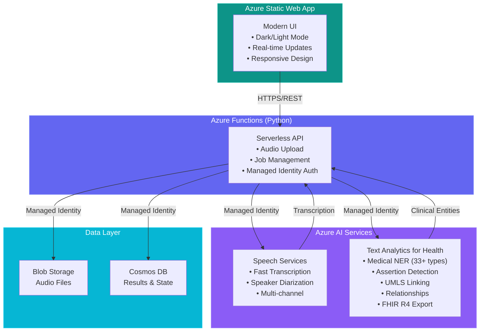

# HealthTranscribe

<div align="center">
  


**Enterprise-grade healthcare transcription and clinical entity extraction platform powered by Azure AI**

[](https://lemon-meadow-03ec82310.4.azurestaticapps.net/)
[](https://azure.microsoft.com)
[](LICENSE)

</div>

---

## Overview

HealthTranscribe is a production-ready, enterprise-grade application that transforms medical audio recordings into structured clinical data. Built with Azure AI Services, it delivers accurate transcription, intelligent medical entity extraction, relationship mapping, and standards-compliant FHIR R4 export — all through an intuitive, modern interface.



## Video Walkthrough

Watch a complete walkthrough demonstration of the system in action:

**[System Walkthrough Video](docs/AITranscriptionTextAnalyticsApp.mp4)**

This screencast demonstrates:
- End-to-end audio transcription workflow
- Medical entity extraction and visualization
- Relationship mapping between clinical entities
- FHIR R4 export functionality
- UI/UX features including dark mode

*Special thanks to [@hannahalisha1](https://github.com/hannahalisha1) for creating this comprehensive walkthrough.*

---

## Key Features

### **High-Accuracy Speech Transcription**
State-of-the-art audio-to-text conversion powered by Azure Speech Services Fast Transcription API.

**Supported Formats:**
- WAV, MP3, M4A, FLAC, OGG formats
- Multi-channel audio support
- Real-time processing feedback
- Batch transcription capabilities

**Advanced Audio Processing:**
- **Real-time Speaker Diarization** — Automatic speaker identification and separation
- **Multi-speaker Recognition** — Distinguish between doctor, patient, and other participants
- **Timestamp Precision** — Word-level timing for accurate playback sync



### **Medical Entity Recognition (NER)**
Advanced clinical entity extraction using Azure Text Analytics for Health, identifying **33+ entity types** with intelligent context:

| Category | Entities |
|----------|----------|
| **Medications** | Drug names, dosages, frequencies, routes, formulations |
| **Conditions** | Diagnoses, symptoms, diseases, disorders |
| **Procedures** | Treatments, surgeries, examinations, interventions |
| **Anatomy** | Body structures, organs, systems, locations |
| **Demographics** | Age, gender, ethnicity, occupation |
| **Clinical Attributes** | Measurements, test results, vital signs |
| **Healthcare Personnel** | Physicians, nurses, specialists, caregivers |

**Advanced Features:**
- **Assertion Detection** — Negation, uncertainty, and conditional detection (e.g., "no signs of infection")
- **UMLS Entity Linking** — Automatic linking to Unified Medical Language System codes
- **Confidence Scoring** — Entity extraction confidence levels



### **Intelligent Relationship Mapping**
Contextual analysis that connects related medical entities:

- **Drug → Dosage** — Medication quantities and administration
- **Condition → Body Structure** — Disease localization
- **Symptom → Time** — Temporal expressions
- **Measurement → Qualifier** — Clinical values with context
- **Procedure → Anatomy** — Treatment locations



### **FHIR R4 Standard Compliance**
Seamless healthcare interoperability with HL7 FHIR R4 Bundle export:

- Standards-compliant resource generation
- EHR system integration ready
- Complete observation and condition resources
- Privacy-preserving data structures



### **99% Cost Reduction**
Dramatic cost savings compared to traditional medical transcription services:

| Service | Cost per Minute | 100 Hours/Month |
|---------|----------------|-----------------|
| **Azure Speech (Batch)** | $0.003 | **$18** |
| **Azure Speech (Real-time)** | $0.017 | **$102** |
| Traditional Services | $0.79 | $4,740 |

**Monthly Savings:** Up to **$4,700** for 100 hours of transcription

### **Modern Enterprise UI/UX**
Professional, responsive interface with healthcare-focused design:

- **Dark/Light Mode** — System preference detection + manual toggle
- **Healthcare Color Palette** — Teal primary with indigo accents
- **Fully Responsive** — Desktop, tablet, and mobile optimized
- **Accessibility First** — WCAG 2.1 AA compliant
- **Real-time Updates** — Live processing status with progress tracking
- **Animated Feedback** — Smooth transitions and loading states

---

## Architecture



### Security Features

- **Zero Secrets Architecture** — All services use Azure Managed Identity
- **disableLocalAuth Enforced** — No API keys in code or configuration
- **RBAC** — Least-privilege role assignments
- **Network Security** — VNet integration ready
- **Audit Logging** — Application Insights monitoring
- **HIPAA Compliant** — Healthcare data handling best practices

---

## Quick Deploy

### **Prerequisites**

- Azure Subscription ([Create free account](https://azure.microsoft.com/free/))
- GitHub Account
- Azure CLI (optional, for manual deployment)

### **Option 1: Automated GitHub Actions Deploy** (Recommended)

**Step 1: Fork & Configure**
```bash
# Fork this repository to your GitHub account
# Then clone your fork locally
git clone https://github.com/<YOUR-USERNAME>/transcription-services-demo.git
cd transcription-services-demo
```

**Step 2: Create Azure Service Principal**
```bash
# Login to Azure
az login

# Create service principal (replace {subscription-id} with your subscription ID)
az ad sp create-for-rbac --name "github-transcription-sp" \
  --role contributor \
  --scopes /subscriptions/{subscription-id} \
  --sdk-auth
```
**Copy the entire JSON output** — you'll need it next.

**Step 3: Configure GitHub Secrets**

Navigate to your repository: **Settings** → **Secrets and variables** → **Actions** → **New repository secret**

Add the following secret:
- **Name:** `AZURE_CREDENTIALS`
- **Value:** Paste the JSON from Step 2

**Step 4: Deploy Infrastructure**

1. Go to **Actions** tab in your repository
2. Select **"0. Deploy All (Complete)"** workflow
3. Click **"Run workflow"**
4. Enter parameters:
   - **Resource Group Name:** e.g., `healthtranscribe-prod`
   - **Azure Region:** e.g., `westus2`, `eastus`, `northeurope`
5. Click **"Run workflow"** button

**Step 5: Add Deployment Tokens**

After infrastructure deployment completes (~5 minutes), add these secrets:

1. Get Function App name from workflow output
2. Get Static Web App token from Azure Portal:
   - Navigate to Static Web App resource
   - Click **"Manage deployment token"**
   - Copy the token

Add secrets:
- **Name:** `AZURE_FUNCTIONAPP_NAME` | **Value:** `<function-app-name>`
- **Name:** `AZURE_STATIC_WEB_APPS_API_TOKEN` | **Value:** `<swa-token>`

**Step 6: Deploy Application**

Run workflows in order:
1. **"Deploy Function App"** — Backend API
2. **"Deploy Frontend"** — Static Web App

**Done!** Your application is now live.

---

### **Option 2: Manual Azure CLI Deploy**

```bash
# 1. Login and set subscription
az login
az account set --subscription <subscription-id>

# 2. Create resource group
az group create --name healthtranscribe-rg --location westus2

# 3. Deploy infrastructure
az deployment group create \
  --resource-group healthtranscribe-rg \
  --template-file infra/main.bicep \
  --parameters environment=prod location=westus2

# 4. Deploy Function App
cd <project-root>
func azure functionapp publish <function-app-name> --python

# 5. Deploy Static Web App
# Get deployment token from Azure Portal first
swa deploy ./frontend --deployment-token <token> --env production
```

---

## Project Structure

```
transcription-services-demo/
├── .github/
│   └── workflows/              # CI/CD Pipelines
│       ├── deploy-all.yml      # Complete deployment workflow
│       ├── deploy-infrastructure.yml
│       ├── deploy-function.yml
│       └── deploy-frontend.yml
│
├── frontend/                   # Static Web App
│   ├── assets/
│   │   ├── logo.svg           # HealthTranscribe logo
│   │   └── favicon.svg        # Browser favicon
│   ├── index.html             # Main application page
│   ├── styles.css             # Enterprise UI styles (2400+ lines)
│   └── app.js                 # Application logic
│
├── infra/                      # Infrastructure as Code
│   └── main.bicep             # Azure Bicep template (all resources)
│
├── docs/                       # Screenshots and documentation
│   ├── dashboard.png
│   ├── upload-interface.png
│   ├── medical-entities.png
│   ├── relationships.png
│   ├── fhir-export.png
│   └── dark-mode.png
│
├── function_app.py            # Azure Functions backend
├── requirements.txt           # Python dependencies
├── host.json                  # Functions runtime config
└── README.md                  # This file
```

---

## API Reference

### Endpoints

| Endpoint | Method | Description | Auth |
|----------|--------|-------------|------|
| `/api/health` | GET | Health check and service status | None |
| `/api/upload` | POST | Upload audio file for processing | None |
| `/api/status/{job_id}` | GET | Get job status and results | None |

### Upload Audio File

**Request:**
```http
POST /api/upload
Content-Type: multipart/form-data

file: <audio-file>
```

**Response:**
```json
{
  "job_id": "uuid-string",
  "status": "submitted",
  "message": "File uploaded successfully"
}
```

### Get Job Status

**Request:**
```http
GET /api/status/{job_id}
```

**Response:**
```json
{
  "job_id": "uuid-string",
  "status": "completed",
  "transcription": "Patient presents with...",
  "entities": [...],
  "relationships": [...],
  "fhir_bundle": {...}
}
```

**Status Values:** `submitted`, `processing`, `completed`, `failed`

---

## Azure Resources

| Resource | SKU/Tier | Purpose | Cost (Est.) |
|----------|----------|---------|-------------|
| **Storage Account** | Standard_LRS | Audio files, function storage | ~$0.02/GB/month |
| **Cosmos DB** | Serverless | Job state and results | Pay-per-request |
| **Speech Services** | S0 | Fast transcription API | $0.003-0.017/min |
| **Language Service** | S | Text Analytics for Health | ~$1/1000 records |
| **Function App** | EP1 Premium | Serverless backend API | ~$200/month |
| **App Service Plan** | EP1 | Function App hosting | Included |
| **Static Web App** | Free | Frontend hosting | **Free** |
| **Application Insights** | Pay-as-you-go | Monitoring and diagnostics | ~$2.30/GB |

**Total Estimated Cost:** ~$210-250/month (processing 100 hours of audio)

### Resource Configuration

All resources are configured with:
- **Managed Identity** for authentication
- **RBAC** role assignments
- **disableLocalAuth** enforced (no keys)
- **Application Insights** integration
- **Diagnostic logging** enabled

---

## Local Development

### Setup

```bash
# Clone repository
git clone https://github.com/<your-username>/transcription-services-demo.git
cd transcription-services-demo

# Create Python virtual environment
python -m venv .venv

# Activate virtual environment
# Windows:
.venv\Scripts\activate
# Linux/Mac:
source .venv/bin/activate

# Install dependencies
pip install -r requirements.txt

# Install Azure Functions Core Tools
npm install -g azure-functions-core-tools@4

# Install Static Web Apps CLI
npm install -g @azure/static-web-apps-cli
```

### Configure Local Settings

```bash
# Create local settings file
cp local.settings.example.json local.settings.json
```

Edit `local.settings.json`:
```json
{
  "IsEncrypted": false,
  "Values": {
    "AzureWebJobsStorage": "UseDevelopmentStorage=true",
    "FUNCTIONS_WORKER_RUNTIME": "python",
    "SPEECH_ENDPOINT": "https://<your-speech>.cognitiveservices.azure.com/",
    "LANGUAGE_ENDPOINT": "https://<your-language>.cognitiveservices.azure.com/",
    "COSMOS_ENDPOINT": "https://<your-cosmos>.documents.azure.com:443/",
    "STORAGE_ACCOUNT_NAME": "<your-storage-account>"
  }
}
```

### Run Locally

```bash
# Start Azure Functions backend
func start

# In another terminal, start frontend (optional)
cd frontend
npx http-server -p 8080
```

Backend runs on `http://localhost:7071`  
Frontend runs on `http://localhost:8080`

---

## Testing

### Test Health Endpoint
```bash
curl http://localhost:7071/api/health
```

### Test Upload
```bash
curl -X POST http://localhost:7071/api/upload \
  -F "file=@sample-audio.wav"
```

### Test Status
```bash
curl http://localhost:7071/api/status/<job-id>
```

---

## Monitoring & Observability

### Application Insights

All telemetry is sent to Azure Application Insights:
- **Request metrics** — API call rates and latencies
- **Exception tracking** — Error rates and stack traces
- **Custom events** — Job processing stages
- **Dependency tracking** — Azure service calls

### Key Metrics to Monitor

| Metric | Alert Threshold | Action |
|--------|----------------|---------|
| Function execution time | > 30s | Scale up or optimize |
| Failed requests | > 5% | Check logs |
| Speech API errors | > 2% | Verify quotas |
| Cosmos RU consumption | > 80% allocated | Scale up |

### Viewing Logs

```bash
# Stream function logs
func azure functionapp logstream <function-app-name>

# Query Application Insights
# Azure Portal → Application Insights → Logs
traces
| where severityLevel > 1
| order by timestamp desc
```

---

## Configuration

### Environment Variables

**Function App:**
- `SPEECH_ENDPOINT` — Azure Speech Services endpoint
- `LANGUAGE_ENDPOINT` — Azure Language Services endpoint
- `COSMOS_ENDPOINT` — Cosmos DB endpoint
- `STORAGE_ACCOUNT_NAME` — Blob storage account name

**Static Web App:**
- `API_URL` — Function App URL (auto-configured in Azure)

### Feature Flags

Customize behavior in `frontend/app.js`:
```javascript
const CONFIG = {
  MAX_FILE_SIZE: 100 * 1024 * 1024, // 100 MB
  POLL_INTERVAL: 2000,               // 2 seconds
  SUPPORTED_FORMATS: ['wav', 'mp3', 'flac', 'ogg', 'm4a'],
  THEME_PREFERENCE: 'auto'           // 'light', 'dark', or 'auto'
};
```

---

## Documentation & Resources

### Azure Services
- [Azure Speech Services Documentation](https://learn.microsoft.com/azure/ai-services/speech-service/)
- [Fast Transcription API Guide](https://learn.microsoft.com/azure/ai-services/speech-service/fast-transcription-create)
- [Text Analytics for Health](https://learn.microsoft.com/azure/ai-services/language-service/text-analytics-for-health/overview)
- [FHIR Integration Guide](https://learn.microsoft.com/azure/ai-services/language-service/text-analytics-for-health/concepts/fhir)
- [Azure Functions Python Developer Guide](https://learn.microsoft.com/azure/azure-functions/functions-reference-python)
- [Managed Identity Best Practices](https://learn.microsoft.com/azure/active-directory/managed-identities-azure-resources/overview)

### Healthcare Standards
- [HL7 FHIR R4 Specification](http://hl7.org/fhir/R4/)
- [HIPAA Compliance on Azure](https://learn.microsoft.com/azure/compliance/offerings/offering-hipaa-us)
- [Healthcare Interoperability](https://learn.microsoft.com/industry/healthcare/healthcare-data-solutions)

### Development Tools
- [Azure Functions Core Tools](https://learn.microsoft.com/azure/azure-functions/functions-run-local)
- [Static Web Apps CLI](https://azure.github.io/static-web-apps-cli/)
- [Azure Bicep Documentation](https://learn.microsoft.com/azure/azure-resource-manager/bicep/)

---

## Contributing

Contributions are welcome! Please follow these guidelines:

1. **Fork** the repository
2. Create a **feature branch** (`git checkout -b feature/amazing-feature`)
3. **Commit** your changes (`git commit -m 'feat: add amazing feature'`)
4. **Push** to the branch (`git push origin feature/amazing-feature`)
5. Open a **Pull Request**

### Code Style
- Python: Follow [PEP 8](https://pep8.org/)
- JavaScript: Use ES6+ features, semicolons required
- CSS: BEM naming convention preferred

---

## Troubleshooting

### Common Issues

**Issue:** Function deployment fails with authentication error  
**Solution:** Verify service principal has Contributor role on subscription

**Issue:** Speech API returns 401 Unauthorized  
**Solution:** Check Function App managed identity has `Cognitive Services User` role

**Issue:** Dark mode not persisting  
**Solution:** Clear browser localStorage and refresh page

**Issue:** Large files fail to upload  
**Solution:** Increase `maxAllowedContentLength` in Function App configuration

### Getting Help

- Check [Azure Documentation](https://learn.microsoft.com/azure/)
- Open an [Issue](https://github.com/samueltauil/transcription-services-demo/issues)
- Contact support

---

## License

This project is licensed under the **MIT License** - see the [LICENSE](LICENSE) file for details.

---

## Acknowledgments

- **[@hannahalisha1](https://github.com/hannahalisha1)** for creating the comprehensive system walkthrough video
- **Azure AI Services** for Speech and Language capabilities
- **Microsoft Healthcare** team for FHIR integration guidance
- **Open Source Community** for inspiration and best practices

---

<div align="center">

**Built with Azure**

[](https://portal.azure.com/#create/Microsoft.Template/uri/https%3A%2F%2Fraw.githubusercontent.com%2Fsamueltauil%2Ftranscription-services-demo%2Fmain%2Finfra%2Fmain.bicep)

[Live Demo](https://lemon-meadow-03ec82310.4.azurestaticapps.net/) • [Report Bug](https://github.com/samueltauil/transcription-services-demo/issues) • [Request Feature](https://github.com/samueltauil/transcription-services-demo/issues)

</div>
