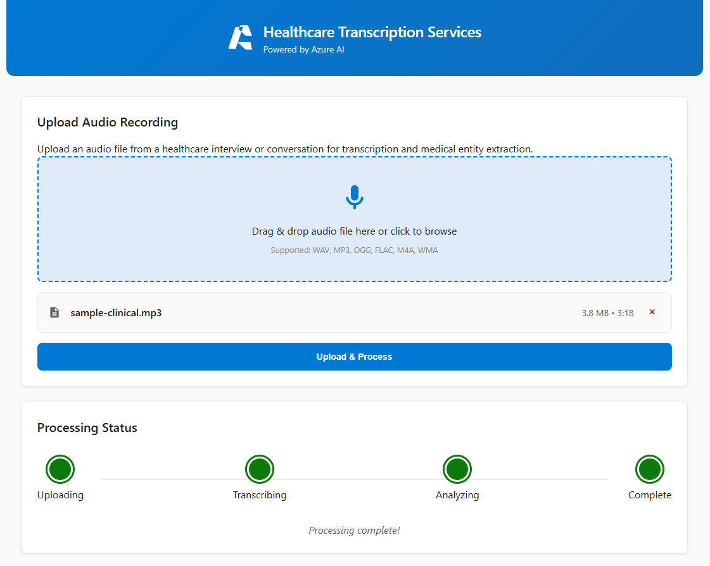
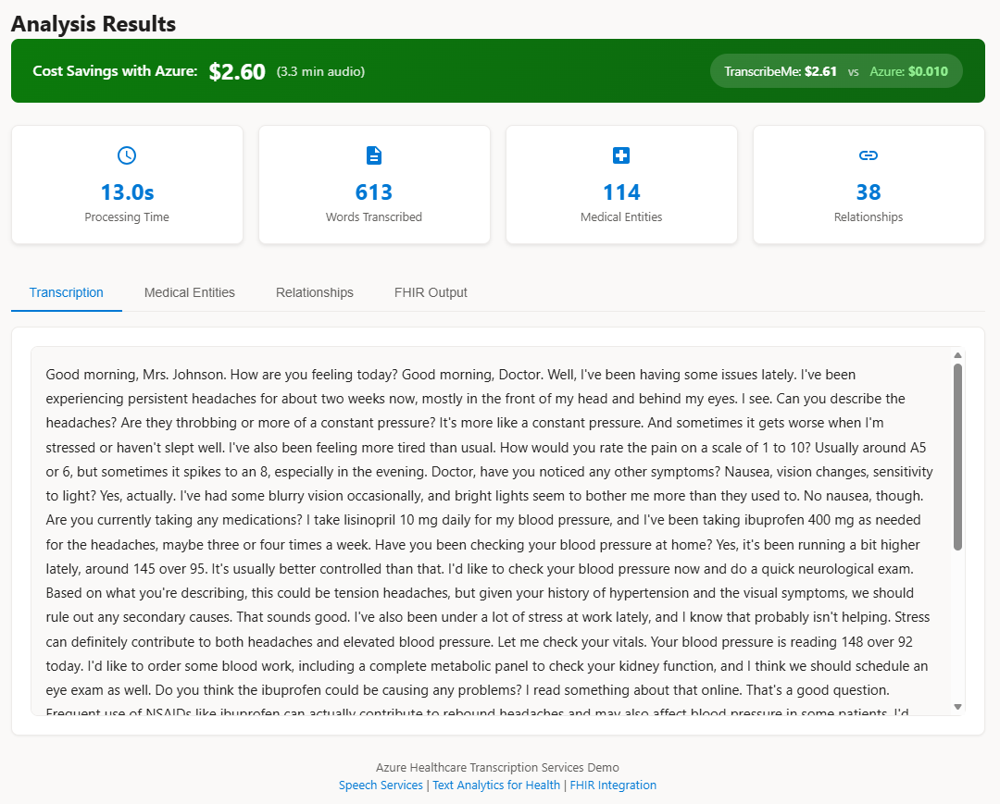

# Azure Healthcare Transcription Services

A production-ready application demonstrating Azure Speech Services for audio transcription with Text Analytics for Health for medical entity extraction and FHIR integration.



## ✨ Features

### 🎤 Audio Transcription
Upload audio files (WAV, MP3, M4A, FLAC, OGG, WEBM) and get accurate transcriptions powered by Azure Speech Services Fast Transcription API.



### 🏥 Medical Entity Extraction
Automatically identify and categorize 33+ types of healthcare entities including:
- **Medications**: Drug names, dosages, frequencies, routes of administration
- **Conditions**: Diagnoses, symptoms, signs
- **Procedures**: Treatments, examinations, surgeries
- **Anatomy**: Body structures, organs, systems
- **Demographics**: Age, gender, ethnicity
- **Healthcare Personnel**: Doctors, nurses, specialists


### 🔗 Relationship Analysis
Understand the connections between medical entities with intelligent relationship mapping:
- Drug → Dosage associations
- Condition → Body structure links
- Symptom → Time expressions
- Treatment → Frequency patterns


### 📋 FHIR R4 Export
Export your analysis as a standards-compliant FHIR R4 Bundle, ready for integration with Electronic Health Records (EHR) systems and healthcare interoperability platforms.


### 💰 Cost Savings
Achieve ~99% cost reduction compared to traditional transcription services:
- **Azure**: $0.003/min (batch) or $0.017/min (real-time)
- **TranscribeMe**: $0.79/min
- **Monthly savings**: $4,700+ for 100 hours of audio

---

## 🚀 Quick Deploy

### Prerequisites
- Azure Subscription
- GitHub account
- Azure CLI installed locally (optional, for manual deployment)

### Option 1: Deploy via GitHub Actions (Recommended)

1. **Fork this repository** to your GitHub account

2. **Create Azure Service Principal** for GitHub Actions:
   ```bash
   az ad sp create-for-rbac --name "github-actions-sp" --role contributor \
     --scopes /subscriptions/{subscription-id} --sdk-auth
   ```
   Copy the JSON output.

3. **Add GitHub Secrets** (Settings → Secrets and variables → Actions):
   - `AZURE_CREDENTIALS`: Paste the service principal JSON from step 2

4. **Run the deployment workflow**:
   - Go to Actions tab → "0. Deploy All (Complete)"
   - Click "Run workflow"
   - Enter your resource group name and Azure region
   - Click "Run workflow"

5. **After infrastructure deploys**, add these additional secrets:
   - `AZURE_FUNCTIONAPP_NAME`: The function app name (shown in workflow output)
   - `AZURE_STATIC_WEB_APPS_API_TOKEN`: Get from Azure Portal → Static Web App → Manage deployment token

### Option 2: Manual Deployment

```bash
# Login to Azure
az login

# Create resource group
az group create --name speech-demo --location westus2

# Deploy infrastructure
az deployment group create \
  --resource-group speech-demo \
  --template-file infra/main.bicep \
  --parameters environment=dev location=westus2

# Note the outputs (functionAppName, staticWebAppName)

# Deploy Function App
func azure functionapp publish <function-app-name> --python

# Deploy Frontend (get token from Azure Portal first)
swa deploy ./frontend --deployment-token <token> --env production
```

## Architecture

```
┌─────────────────┐    ┌──────────────────┐    ┌─────────────────────┐
│  Static Web App │ →  │ Azure Functions  │ →  │ Azure Speech API    │
│   (Frontend)    │    │   (Backend)      │    │ (Fast Transcription)│
└─────────────────┘    └──────────────────┘    └─────────────────────┘
                                ↓
┌─────────────────────────────────────────────────────────────────────┐
│              Text Analytics for Health (Managed Identity)           │
│       Medical Entities • Relationships • FHIR Bundle Generation     │
└─────────────────────────────────────────────────────────────────────┘
                                ↓
┌─────────────────┐    ┌──────────────────┐    ┌─────────────────────┐
│  Blob Storage   │    │    Cosmos DB     │    │  FHIR-Compatible    │
│ (Audio Files)   │    │   (Results)      │    │     Output          │
└─────────────────┘    └──────────────────┘    └─────────────────────┘
```

### Security
- **Managed Identity**: All Azure services use managed identity authentication (no API keys)
- **disableLocalAuth**: Enforced on Cognitive Services per enterprise policy
- **RBAC**: Proper role assignments for Function App to access all services

## Project Structure

```
transcription-services-demo/
├── .github/workflows/         # GitHub Actions CI/CD
│   ├── deploy-all.yml         # Complete deployment
│   ├── deploy-infrastructure.yml
│   ├── deploy-function.yml
│   └── deploy-frontend.yml
├── frontend/                  # Static Web App
│   ├── index.html
│   ├── styles.css
│   └── app.js
├── infra/                     # Infrastructure as Code
│   └── main.bicep             # Azure Bicep (all resources)
├── function_app.py            # Azure Functions backend
├── requirements.txt           # Python dependencies
└── host.json                  # Functions configuration
```

## API Endpoints

| Endpoint | Method | Description |
|----------|--------|-------------|
| `/api/health` | GET | Health check |
| `/api/upload` | POST | Upload audio file |
| `/api/status/{job_id}` | GET | Get job status and results |

## Azure Resources Created

| Resource | SKU | Purpose |
|----------|-----|---------|
| Storage Account | Standard_LRS | Audio files, Function App storage |
| Cosmos DB | Serverless | Job storage (managed identity auth) |
| Speech Services | S0 | Audio transcription |
| Language Service | S | Text Analytics for Health |
| Function App | EP1 (Elastic Premium) | Backend API |
| App Service Plan | EP1 | Required for managed identity storage binding |
| Static Web App | Free | Frontend hosting |
| Application Insights | - | Monitoring |

## GitHub Secrets Reference

| Secret | Description | Required |
|--------|-------------|----------|
| `AZURE_CREDENTIALS` | Service principal JSON for Azure login | Yes |
| `AZURE_FUNCTIONAPP_NAME` | Name of deployed Function App | For function deployments |
| `AZURE_STATIC_WEB_APPS_API_TOKEN` | SWA deployment token | For frontend deployments |

## Local Development

```bash
# Create virtual environment
python -m venv .venv
source .venv/bin/activate  # Linux/Mac
.venv\Scripts\activate     # Windows

# Install dependencies
pip install -r requirements.txt

# Configure local settings
cp local.settings.example.json local.settings.json
# Edit local.settings.json with your Azure credentials

# Run locally
func start
```

## Documentation

- [Azure Speech Fast Transcription](https://learn.microsoft.com/azure/ai-services/speech-service/fast-transcription-create)
- [Text Analytics for Health](https://learn.microsoft.com/azure/ai-services/language-service/text-analytics-for-health/overview)
- [FHIR Integration](https://learn.microsoft.com/azure/ai-services/language-service/text-analytics-for-health/concepts/fhir)
- [Managed Identity for Functions](https://learn.microsoft.com/azure/azure-functions/functions-identity-access-azure-sql-with-managed-identity)

## License

MIT License
